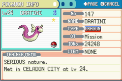
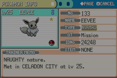

# Shiny Hunter

Automated shiny hunting for Pokemon FireRed/LeafGreen on real Nintendo Switch hardware. Uses an ESP32-S3 as a USB gamepad emulator, a capture card for frame analysis, and visual detection to identify shiny Pokemon.

<p align="center">
  
  
  
  <br>
  <em>Shiny Charmander (starter RNG) · Shiny Dratini (Celadon casino soft-reset) · Shiny Eevee (Celadon Mansion gift soft-reset)</em>
</p>

## Hardware Setup

| Component | Role |
|-----------|------|
| **Nintendo Switch** | Runs FireRed/LeafGreen |
| **ESP32-S3 DevKitC-1** | Emulates a Pokken Tournament DX Pro Pad (USB HID gamepad) |
| **USB capture card** (MiraBox) | Captures Switch HDMI output for frame analysis |
| **Mac** (host) | Runs this Node.js app — sends commands to ESP32, reads frames from capture card |

**Wiring:**
- ESP32 "USB" port (native) → Switch dock USB port (via USB-A-to-C cable)
- ESP32 "COM" port (UART) → Mac (serial commands at 115200 baud)
- Switch HDMI → capture card → Mac USB

The firmware is in `firmware/switch-controller/switch-controller.ino`. Flash it to the ESP32-S3 via Arduino IDE.

## Quick Start

```bash
npm install
cp .env.example .env   # configure your settings
npm run build
npm start              # or: npm run dev
```

Once running, open **http://localhost:3002/dashboard** and hit `POST /api/hunt/start` to begin. All dashboards include a live game view from the capture card.

## Hunt Types

### Starter (Charmander, Squirtle, Bulbasaur)

Reset-based hunt with optional RNG manipulation. Save in Oak's Lab in front of the Pokeball.

```env
TARGET_POKEMON=charmander
HUNT_TYPE=starter
HUNT_MODE=switch-rng     # or reset (no RNG)
```

Soft reset → title screen → load save → pick starter → open summary → check if shiny → reset if not.

The `switch-rng` mode uses TID/SID-based RNG manipulation to target specific shiny seeds, improving odds from 1/8192 to ~1/200 or better.

### Fossil (Aerodactyl, Kabuto, Omanyte)

Reset-based hunt. Give your fossil to the Cinnabar Lab scientist first, then save in front of him.

```env
TARGET_POKEMON=aerodactyl
HUNT_TYPE=static
PARTY_SLOT=2
```

### Lapras (Silph Co 7F)

Reset-based hunt. Beat your rival on 7F, then save in front of the employee who gives you Lapras.

```env
TARGET_POKEMON=lapras
HUNT_TYPE=static
PARTY_SLOT=2
```

### Wild (Pikachu, Nidoran, etc.)

Walk-in-grass continuous hunt. No soft resets — walks until a shiny is detected in battle.

```env
TARGET_POKEMON=pikachu
HUNT_TYPE=wild
```

Walks up/down → detects battle → OCRs species from text box → burst captures frames for sparkle detection + palette analysis → runs if not shiny, stops if shiny so you can catch manually.

### Casino / Gift (Dratini, Eevee, etc.)

Soft-reset in front of the NPC that gives / sells the Pokemon. Same flow as other static hunts — just save in the right spot first.

```env
TARGET_POKEMON=dratini   # or eevee, porygon, abra, scyther, ...
HUNT_TYPE=static
PARTY_SLOT=2             # match the party slot the gift lands in
```

Works for Celadon Game Corner prizes (Abra, Clefairy, Scyther, Pinsir, Dratini, Porygon), Celadon Mansion Eevee, fossils on Cinnabar, Lapras on Silph 7F, Hitmonlee / Hitmonchan, etc.

### Legendary (Articuno, Zapdos, Moltres, Mewtwo, Snorlax)

Soft-reset in front of the legendary Pokemon. Save directly in front of it before starting.

```env
TARGET_POKEMON=articuno
HUNT_TYPE=static         # legendary encounters reuse the static engine
PARTY_SLOT=1
```

## Target Shiny Team

| # | Pokemon | Evolution | Hunt Type | Status |
|---|---------|-----------|-----------|--------|
| 1 | Charmander | Charizard | starter (RNG) | **Caught** |
| 2 | Dratini | Dragonite | casino soft-reset | **Caught** |
| 3 | Eevee | - | gift soft-reset | **Caught** |
| 4 | Aerodactyl | - | fossil | Pending |
| 5 | Lapras | - | static gift | Pending |
| 6 | Articuno | - | legendary | Hunting |
| 7 | Pikachu | Raichu | wild | Pending |

## Shiny Detection

| Hunt Type | Method |
|-----------|--------|
| **Starter / Static / Fossil** | Summary screen border color analysis — compares hue distribution against known normal/shiny palettes |
| **Wild** | Dual detection: (1) sparkle cluster analysis on enemy sprite region during entry animation, (2) palette comparison using species identified via OCR against known normal/shiny hue signatures |

### Wild Detection Pipeline

1. **Battle detection** — checks for dark text box at bottom of frame
2. **Species OCR** — Tesseract on "Wild X appeared!" text (grayscale → threshold → 4x upscale), fuzzy matched via Levenshtein distance
3. **Sparkle scan** — burst captures 8 frames over 2s, looks for bright pixel clusters (3+ clusters with 30+ total pixels = shiny)
4. **Palette check** — extracts hue distribution from enemy sprite, scores against species' known normal vs shiny palette
5. **Decision** — shiny if either sparkle OR palette detects it

All 152 Gen 1 Pokemon palettes are auto-generated from PokeAPI sprite data via `scripts/extract-palettes.ts`.

## API

All endpoints at `http://localhost:3002`.

| Method | Endpoint | Description |
|--------|----------|-------------|
| `GET` | `/api/status` | Hunt status + lifetime stats |
| `POST` | `/api/hunt/start` | Start hunting |
| `POST` | `/api/hunt/stop` | Stop hunting |
| `GET` | `/api/history` | Hunt history + shiny finds |
| `GET` | `/dashboard` | Live dashboard (auto-selects by hunt type) |
| `GET` | `/api/rng/status` | RNG engine state + calibration |
| `POST` | `/api/rng/set-tid` | Set Trainer ID: `{ "tid": 24248 }` |
| `POST` | `/api/rng/skip-sid` | Skip SID deduction → multi-SID targeting |
| `GET` | `/api/static/encounters` | Static hunt encounter log |
| `GET` | `/api/wild/encounters` | Wild hunt encounter log |

## Project Structure

```
src/
  config.ts                  # Environment config
  index.ts                   # Entry point
  server.ts                  # Express API + dashboards
  types.ts                   # Shared types

  engine/
    hunt-engine.ts           # Basic soft-reset engine
    static-hunt.ts           # Static/fossil/gift/legendary soft-reset engine
    legendary-hunt.ts        # Legendary encounter engine
    wild-hunt.ts             # Wild encounter (walk-in-grass) engine
    rng-engine.ts            # RNG manipulation engine (emulator)
    rng-switch.ts            # Switch RNG engine (blind timing)
    static-rng.ts            # Static + RNG boot timing
    suspend-rng.ts           # Suspend-point RNG (frame counting)
    rng.ts                   # PRNG (linear congruential, Gen 3)
    sequences.ts             # Button press sequences
    iv-calc.ts               # IV calculator
    pid-finder.ts            # PID identification from stats
    calibration.ts           # TID/SID calibration state
    multi-sid-target.ts      # Multi-SID seed scheduling
    seed-table.ts            # Seed → shiny lookup tables
    sid-deduction.ts         # SID elimination from PID observations

  detection/
    shiny-detector.ts        # Summary screen shiny detection
    battle-shiny.ts          # Battle sparkle detection (wild)
    battle-info.ts           # Battle text box OCR
    battle-palette.ts        # Sprite palette analysis
    generated-palettes.ts    # Auto-generated palettes (152 Pokemon)
    color-palettes.ts        # Manual normal/shiny hue signatures
    stats-ocr.ts             # Pixel template matching for stats
    summary-info.ts          # Summary screen OCR

  drivers/
    switch-input.ts          # ESP32 serial → Switch USB HID
    capture-card-frames.ts   # ffmpeg capture card frame grab
    emulator-input.ts        # mGBA Lua bridge input
    emulator-frames.ts       # mGBA screenshot capture
    frame-source.ts          # Frame source interface

  services/
    discord.ts               # Discord webhook notifications
    stats.ts                 # SQLite hunt statistics

firmware/
  switch-controller/
    switch-controller.ino    # ESP32-S3 Arduino firmware (Pokken pad HID)

scripts/
  extract-palettes.ts       # Download FRLG sprites → generate palettes

docs/                        # Screenshots and assets
data/                        # SQLite DB, calibration, sprites (gitignored)
screenshots/                 # Encounter screenshots (gitignored)
test/                        # Jest tests
```

## Testing

```bash
npm test              # All tests
npm run test:rng      # RNG engine tests
npm run test:switch   # Switch RNG tests
npm run test:pid      # PID identification tests
```

## Environment

The app supports two environments via `HUNT_ENV`:

- **`switch`** (primary) — ESP32-S3 serial + capture card. Visual detection only. RNG manipulation via blind timing.
- **`emulator`** — mGBA via Lua bridge (TCP). Save states, turbo mode, memory reads for full RNG manipulation.
